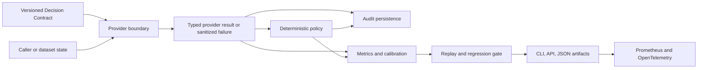

# V0.1.0 release guide

## What V0 demonstrates

Jev DecisionOps V0 is a typed decision-quality and reliability layer. It validates versioned Decision Contracts, calls a provider through an isolated adapter, applies deterministic ACT/REVIEW/FALLBACK policy, records audit-ready execution data, evaluates labelled datasets, compares replays, and exposes a local API/CLI/telemetry surface.

It is not a workflow runtime, agent framework, durable evaluation-artifact service, model-training system, or a substitute for human review. `ACT` means a deterministic policy selected that disposition; it does not execute an external business action in V0.

## Architecture



The diagram shows data-flow ownership, not a claim that every arrow is a synchronous production transaction. API evaluation artifacts are intentionally in-memory; PostgreSQL audit persistence is a separate boundary.

## Reproducible synthetic demo

The checked-in [example contract](../contracts/support-ticket-triage.yaml) and [labelled dataset](../tests/fixtures/datasets/support-ticket-triage-v1.yaml) provide four synthetic cases. Repeat that fixture 125 times to generate a deterministic 500-case synthetic demo with no API key, network call, or provider SDK request:

```bash
uv sync --all-groups
uv run python scripts/run_synthetic_demo.py --repeat 125 --output demo-artifacts
uv run decisionops compare \
  --baseline demo-artifacts/baseline-replay.json \
  --current demo-artifacts/candidate-replay.json \
  --thresholds <(printf '{"version":1,"minimum_accuracy":1.0}') \
  --json
```

The generated `baseline-replay.json`, `candidate-replay.json`, and `comparison.json` are deterministic JSON artifacts and may be committed to a project-specific evidence repository after reviewing their contents. They carry no raw fixture state. The candidate intentionally misclassifies cancellation cases, so the comparison fails its `minimum_accuracy=1.0` gate and the CLI returns exit code `1`.

The process-substitution convenience in the final command is shell-specific. In CI, use a checked-in JSON thresholds file instead.

## CI and live-provider separation

`.github/workflows/ci.yml` runs on pushes, pull requests, and manual dispatches. It uses no provider credential and gates formatting, linting, strict typing, unit coverage, PostgreSQL migration/integration, Docker build, static boundary checks, package build, and the synthetic demo.

`.github/workflows/live-provider-smoke.yml` is manual-only. It requires the dispatcher to set `confirm_live_provider_call=true`, then reads `TYPESAFE_API_KEY` from the GitHub Actions secret store and sends only a synthetic test state. It prints provider/model/latency or a sanitized failure class—never an API key, raw state, or provider body.

## Methodology and benchmark caveat

Metrics are calculated on explicitly versioned labelled data bound to an exact contract fingerprint. Accuracy, Brier score, ECE, confidence buckets, provider failure rate, policy coverage, and latency describe that dataset/run only. They do not establish production accuracy, clinical validity, fairness, or a vendor benchmark.

TypeSafe/Jev material, models, and SDK integration are vendor inputs. Any vendor-published benchmark is not a Jev DecisionOps result unless this repository records the exact dataset, contract fingerprint, provider/model metadata, threshold configuration, and reproducible artifact that produced it.

## V0.1.0 release checklist

- [x] Locked dependencies resolve with `uv sync --locked --all-groups`.
- [x] Local quality commands cover format, lint, strict mypy, unit tests, coverage, lock, and build.
- [x] CI workflow is secrets-free for pull requests and pushes.
- [x] PostgreSQL migration and integration job is declared.
- [x] Docker build, security-boundary, and synthetic-demo CI jobs are declared.
- [x] Manual live-provider smoke workflow is opt-in and separated from normal CI.
- [x] README and architecture/methodology/limitations guidance exist.
- [ ] Observe successful hosted CI runs after this release commit is pushed.
- [ ] Build and publish a GitHub `v0.1.0` release/tag after hosted CI is green.
- [ ] Run any desired live-provider smoke only with an authorized secret and explicit operator approval.
